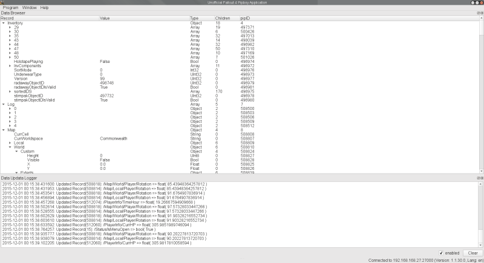
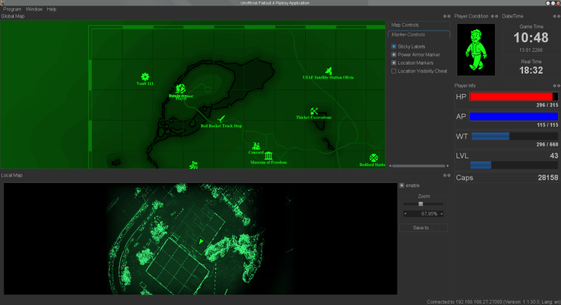
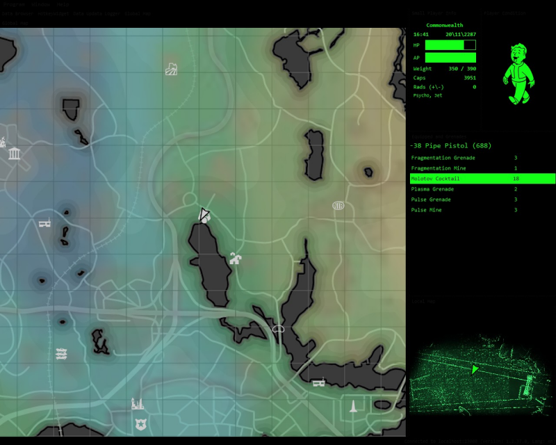

  

# PyPipboyApp

PyPipboyApp is a platform independent and extensible unofficial Fallout 4 Pipboy Companion App written in Python3 using PyQt5 and [PyPipboy](https://github.com/matzman666/PyPipboy). Using a plugin mechanism it can be extendet with additional widgets and styles.

# Motivation

The motivation is to provide anyone with a highly customizable second monitor/screen application for the Fallout 4 game ([www.fallout4.com](https://www.fallout4.com/)) on the major operation systems. Therefore the application is written in Python3 and Qt. It extensively uses dock windows that can be dragged and dropped (or hidden) where-ever the users likes them to be. New widgets can be easily added just by dropping them into a directory. It also uses Qt style sheets to allow others to easily customize the style of the GUI.

# Features

Currently implemented features are:
 - Uses [PyPipboy](https://github.com/matzman666/PyPipboy) for the communication layer.
 - Widgets plugin mechanism.
 - Runtime support for Qt style sheets.
 - Currently available widgets:
   - Data Browser
   - Data Update Logger
   - Player Info
   - Player Condition (showing limb damage)
   - Date/Time
   - Map (Global and Local)
   - Hotkeys (by akamal)
   - Equipped Weapons and Grenades (by akamal)
   - Small Player Info (by akamal)
   - Active Effects
   - Radio
   - Location Browser

# Screenshots

  
 
# Current Status

PyPipboy is at the beginning of the development. The first version of the GUI framework is ready including widget and style plugin mechanism is complete. There are also some working widgets and style examples.

# Usage

For now the best option is to download the provided archives in the [release section](https://github.com/matzman666/PyPipboyApp/releases).

Manual Installation:
- Install Python3, PyQt5, PyPipboy and its dependencies
- Download the application and run pypipboyapp.py (Beware that the version in the git repository does not contain any graphical assets as they are owned by Bethesda).


# Widget development

A widget consists of a directory containing Python3 code files and any needed resources. The entry point of a widget is the file info.py

#### Directory layout

```
- PyPipboyApp/
-- widgets/
--- your_widget/
---- info.py
---- ...
--- ...
```

#### info.py

```python
from widgets import widgets
from .dataupdateloggerwidget import DataUpdateLoggerWidget

# Holds meta-information about the widgets
class ModuleInfo(widgets.ModuleInfoBase):
    LABEL = 'dataupdatelogger' # Unique widget label
    NAME = 'Data Update Logger' # Human readable name
    # Factory function that returns a (or a list of) widget instance
    #   handle ... handle representing the widget ()
    #   parent ... QtWidget parent
    @staticmethod
    def createWidgets(handle, parent):
        return YourWidget(handle, parent)
```

#### Your widget class

```python
# widgets.WidgetBase inherits from QtDockWidget
class YourWidget(widgets.WidgetBase):
    def __init__(self, mhandle, parent):
        super().__init__('Data Browser', parent)
        ...
    # Gets called when everything has been set up
    #   framework ... reference to the framework
    #   datamanager ... reference to the PipboyDataManager instance from PyPipboy library
    def init(self, framework, datamanager):
        super().init(app, datamanager)
        ...
    
```

# Style development

A style consists of a directory with a Qt style sheet named 'style.qss' and any needed resources.

#### Directory layout

```
- PyPipboyApp/
-- styles/
--- your_style/
---- style.qss
---- ...
--- ...
```

#### style.qss

For more information see [here](http://doc.qt.io/qt-5/stylesheet.html), or included example styles.

# Known bugs

It is in an very early alpha state, there are bound to be bugs.

# Contribution

Everyone who wants to contribute is welcome.

# License

This software is released under GPL 3.0.

 
